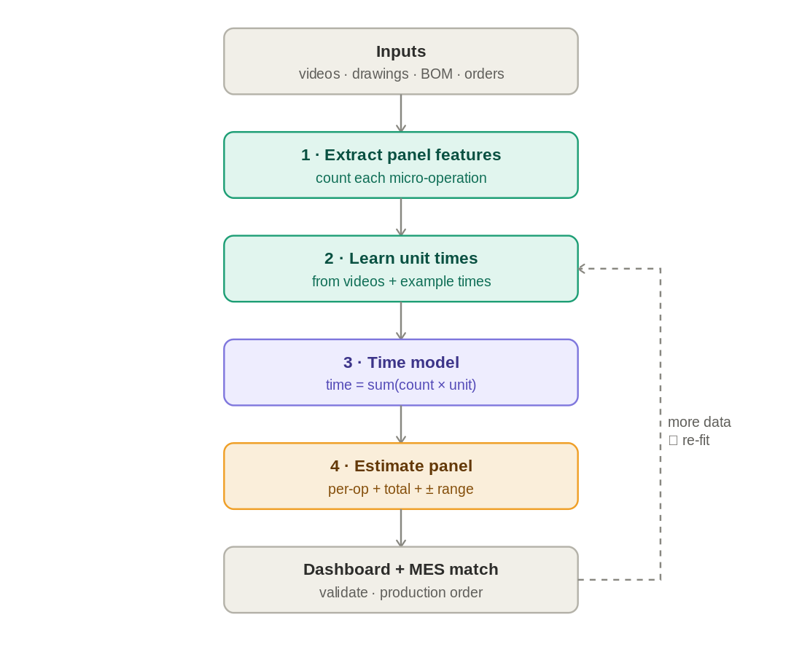

# TimeTwin — production-time estimator for stud-wall panels

**AI Fixathon 2026 · Challenge: Blufab (Casais Group) — modular bathroom panels**

TimeTwin estimates the **production time per micro-operation** and the **total**
for any stud-wall panel, learning the time of each operation from production
videos + drawings, and generalising to panels that have **not been built yet**.

> Computer vision is the data-capture mechanism — the product is the predictive
> model. Explainable, cheap to run, and it improves as more data arrives.



## What it does

- Reads a panel's features from the drawing/BOM (studs, boards, drillings, cladding…).
- Learns the seconds per micro-operation from labelled panels.
- Predicts time per micro-operation + total, with a **confidence range (X ± %)**.
- Matches the panel to its **MES production order**.
- Optional: a computer-vision layer (YOLO + tracking) auto-times the videos.

`total time = setup + Σ (count of each micro-op × its unit time)`

## Quick start

```bash
python generate_data.py        # synthetic sample data
python cli.py                  # fit + predict the unseen test panels
python validate_accuracy.py    # accuracy proof (cross-validation)
python build_dashboard.py      # regenerate the HTML dashboard
```

No installs needed for the above. For the extras:

```bash
python -m pip install numpy openpyxl streamlit
python run_end2end.py          # synthetic video -> real CV -> model
python -m streamlit run app.py # interactive dashboard
```

"Plug in their data" flow (at the event, swap the files in `data_in/`):

```bash
python make_sample_inputs.py   # sample files in Blufab's format
python run_real_data.py        # ingest + estimate (no code changes)
```

## Status

Working synthetic prototype: recovers unit times within a few %, **~5–7% error
on unseen panels**, with a stated confidence band. Ready to ingest real data.

## Project structure

```
src/            features, model, ingest, vision_lite (real), vision_yolo (production)
data/           synthetic dataset (panels.json)
data_in/        sample inputs in Blufab's format (Excel/CSV)
cli.py · run_end2end.py · run_real_data.py · build_dashboard.py · app.py
COMO_CORRERLO_EN_TU_MAC.md · GITHUB_COMO_SUBIR.md
```

## Data & IP

All bundled data is **synthetic**. Do **not** commit Blufab's confidential data
(videos, real Excel/drawings) — the `.gitignore` blocks videos and `data_real/`.
Challenge data is the owner's property (delete within 48h; 60-day embargo).

Public datasets to validate the vision on real video (IKEA-ASM, Assembly101…)
are referenced in [DATASETS.md](DATASETS.md) — linked, not committed (multi-GB, CC BY-NC).
